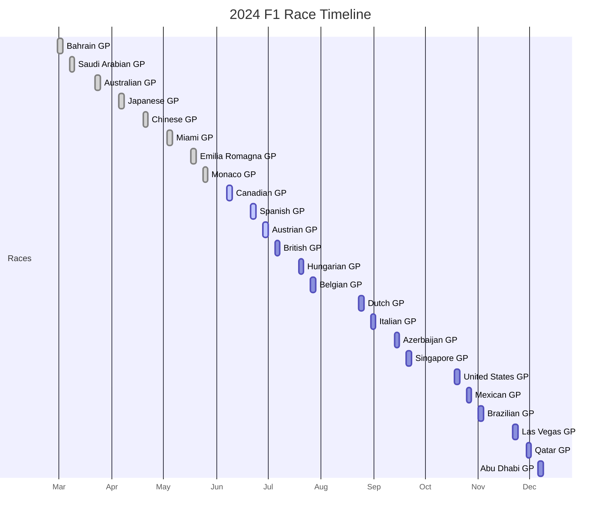
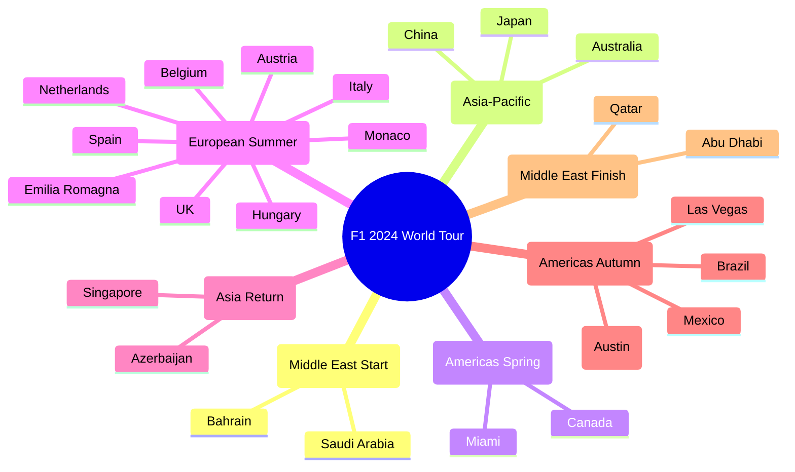
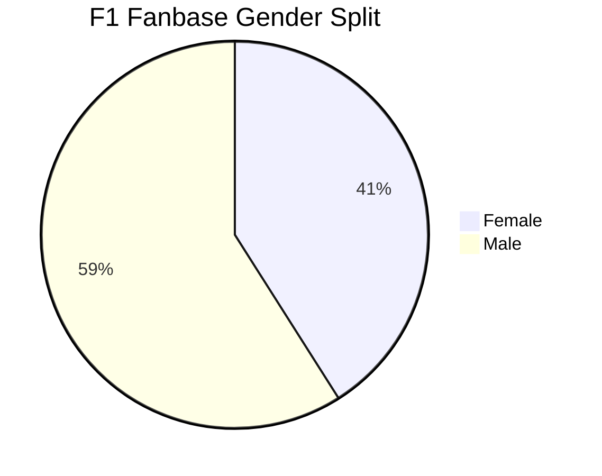

# Formula 1 Fan Engagement Research - Findings

This document contains the findings from our research based on the questions outlined in `f1-research-1.md`.

## I. F1 Buzz & Current State

### 1. What is currently exciting people and creating buzz about F1?

- **Hamilton to Ferrari (for 2025):** This is a monumental story. The move of a seven-time world champion to F1's most iconic team has generated immense buzz and will be a dominant narrative through 2024 and into 2025.
- **Intensifying Rivalries:** The on-track and off-track rivalry between Max Verstappen and George Russell is escalating, with strategic, pointed comments suggesting a future battle for dominance.
- **Challenger Teams Improving:** Teams like Haas are showing surprising performance turnarounds, making the midfield battle more competitive and less predictable.
- **New Talent:** The emergence of highly-rated rookies like Ollie Bearman, who had a very impressive substitute drive for Ferrari, brings fresh energy and storylines to the grid.
- **Red Bull's Vulnerability:** After a period of sheer dominance, Red Bull showed moments of weakness in 2024 (e.g., Monaco). This hints at a potentially more competitive championship, which is a major draw for fans.
- **Anticipation for 2026 Regulations:** There is significant discussion and anticipation for the 2026 season. New regulations will bring smaller, lighter cars, 100% sustainable fuels, and revised power units, which is expected to reset the competitive order.

### 2. How many races are in the current F1 season, and what are their locations?

The 2024 Formula 1 season features a record **24 races**.

**2024 F1 Race Calendar:**

| Date | Grand Prix | Venue |
| :--- | :--- | :--- |
| Feb 29 – Mar 2 | Bahrain | Sakhir |
| Mar 7-9 | Saudi Arabia | Jeddah |
| Mar 22-24 | Australia | Melbourne |
| Apr 5-7 | Japan | Suzuka |
| Apr 19-21 | China | Shanghai |
| May 3-5 | Miami | Miami |
| May 17-19 | Emilia Romagna | Imola |
| May 24-26 | Monaco | Monaco |
| Jun 7-9 | Canada | Montreal |
| Jun 21-23 | Spain | Barcelona |
| Jun 28-30 | Austria | Spielberg |
| Jul 5-7 | United Kingdom | Silverstone |
| Jul 19-21 | Hungary | Budapest |
| Jul 26-28 | Belgium | Spa |
| Aug 23-25 | Netherlands | Zandvoort |
| Aug 30 – Sep 1 | Italy | Monza |
| Sep 13-15 | Azerbaijan | Baku |
| Sep 20-22 | Singapore | Singapore |
| Oct 18-20 | USA | Austin |
| Oct 25-27 | Mexico | Mexico City |
| Nov 1-3 | Brazil | Sao Paulo |
| Nov 21-23 | Las Vegas | Las Vegas |
| Nov 29 – Dec 1 | Qatar | Lusail |
| Dec 6-8 | Abu Dhabi | Yas Marina |

## II. Target Audience

### 3. Who is the target audience for F1? (Demographics, Interests)

*   **Global Reach:** Formula 1 has a massive global fanbase, estimated at around 750 million people.
*   **Rapidly Growing Female Audience:** This is one of the most significant shifts. The fan base is now approximately **41% female**, a dramatic increase from previous years. This growth is heavily influenced by new forms of media and content.
*   **Younger Demographic:** The **16-24 year-old** age group is the fastest-growing segment, indicating a successful push to attract a new generation of fans.
*   **Geographic Growth:** While established in Europe, F1 is seeing its largest growth in the Middle East (specifically UAE and Saudi Arabia) and the United States, which now hosts three Grand Prix.
*   **Broadening Interests:** The modern F1 fan is not just a motorsport enthusiast. They have strong affinities with luxury goods, fashion, beauty, and technology. Female fans, for example, are significantly more likely to visit websites for department stores, beauty/fashion, and home furnishings.

### 4. What are the key segments within the F1 fan base?

*   **The "Netflix Effect" Fan:** A large and influential segment became fans after watching the Netflix series *Drive to Survive*. This group is often new to the sport, more diverse, and engages heavily with the human-interest stories, rivalries, and personalities behind the drivers and teams. For many in this group, being a fan doesn't necessarily mean watching every race live; it's about following the storylines on social media and other platforms.
*   **The "Purist" or "Habitual" Fan:** This is the traditional, long-standing F1 fan. They are deeply interested in the technical aspects of the sport, the racing itself, and its history. They are more likely to feel that the "best" experience is watching the full race on television to absorb all the technical details.
*   **The "Social" Fan:** This segment is younger, highly active on digital platforms, and engages with F1 through social media. Their interest is often sparked by major talking points, memes, and content from influencers and the drivers themselves. They consume bite-sized content like race highlights, team radio clips, and driver vlogs.
*   **"Excitables":** A highly engaged group with a younger profile that is very active in the F1 community. They attend races, buy merchandise, and follow multiple sports.
*   **"Peripherals" and "Incidentals":** These are casual observers with a lower level of engagement, who might tune in for a big race or follow major headlines but are not deeply invested.

```mermaid
gantt
    title F1 Fan Engagement Levels (Among Sports Fans)
    dateFormat  X
    axisFormat %
    
    section Engagement
    Avid Fans ("Never miss a race") :done, 0, 9
    Regular Viewers :active, 9, 36
    Occasional Fans : 36, 51
    Basic Interest : 51, 63
```

## III. Competitive Landscape (Social Media)

### 5. How are existing social media platforms used by F1 fans and entities?

*   **Instagram:** This is a primary platform for visual storytelling. Teams and drivers use it for high-quality photos, behind-the-scenes Reels, and short video clips. Fans use it to follow their favorite drivers and teams, engage with posts, and participate in trends. It's a key platform for showcasing the lifestyle and glamour associated with F1.
*   **TikTok:** This platform is used for short, engaging, and often humorous content. It's ideal for reaching the younger demographic with memes, viral trends, and quick highlights. The content is less formal and more focused on entertainment.
*   **Twitter/X:** This is the platform for real-time updates, news, and conversations. Teams and F1 itself use it for live-tweeting during races, sharing breaking news, and interacting directly with fans through Q&As and polls. Fans use it to follow live commentary, share immediate reactions, and participate in discussions with other fans and journalists.
*   **Reddit:** This is where in-depth community discussion happens. Subreddits like `r/formula1` are hubs for dedicated fans to discuss technical details, race strategies, and news. It's a more niche platform for the "purist" and highly engaged fan segment who want to have detailed conversations.
*   **YouTube:** This is the home for long-form content. Teams, F1, and content creators post race highlights, documentaries, driver interviews, technical explanations, and full-length shows. It caters to fans who want a deeper dive into the sport.

### 6. What kind of F1 content is most popular on these platforms?

*   **Behind-the-Scenes Access:** Across all platforms, content that gives fans a glimpse into the lives of drivers and the inner workings of the teams is extremely popular. This includes driver vlogs, "day in the life" videos, and garage tours.
*   **User-Generated Content (UGC):** Fans love to create and share their own content, from memes to race analysis videos. Brands and teams that feature UGC can build strong community bonds.
*   **Memes and Humor:** Especially on TikTok and Twitter, funny and relatable content performs very well. This helps make the sport more accessible and entertaining for a broader audience.
*   **Highlights and Action Clips:** Short, exciting clips of overtakes, crashes, and dramatic moments are highly shareable and popular, especially on Instagram and TikTok.
*   **Driver-Focused Content:** The drivers are the stars. Content that showcases their personalities, rivalries, and off-track lives is a major driver of engagement.
*   **Interactive Content:** Polls, Q&As, and quizzes on platforms like Twitter and Instagram help fans feel more involved and connected to the sport.

### 7. Which dedicated F1 apps are popular among fans, and what features do they offer?

There are a few key apps that cater to F1 fans, each with a slightly different focus:

**1. The Official Formula 1 App**

*   **Role:** The all-in-one official source for F1 content.
*   **Key Features:**
    *   **News & Analysis:** The latest headlines, race reports, and technical analysis directly from F1.
    *   **Schedules & Results:** Real-time results, driver and constructor standings, and race weekend schedules.
    *   **Live Timing (Free & Paid):** A free leaderboard with live timings is available.
    *   **F1 Fantasy:** The official platform for managing F1 Fantasy teams.
*   **Premium Features (with F1 TV Subscription):**
    *   **Live Telemetry:** In-depth data including tire information, lap times, speed, and DRS usage.
    *   **Interactive Driver Maps:** Real-time tracking of all cars on the circuit.
    *   **Live Audio Commentary:** Live commentary in English.
    *   **Team Radio:** Access to listen in on the drama of team radio communications.
*   **Target Audience:** Caters to all fan segments, from casual followers who want news and results to dedicated fans who subscribe for detailed live data.

**2. Box Box**

*   **Role:** A fan-centric app focused on widgets and a clean user interface. It's often praised for being more user-friendly and aesthetically pleasing than the official app.
*   **Key Features:**
    *   **Widgets:** Its standout feature. It offers highly customizable home screen and lock screen widgets for race countdowns, schedules, and driver/team standings. This allows fans to get key information at a glance.
    *   **Race Schedules & Stats:** Provides schedules in local time zones, along with circuit stats and weather forecasts.
    *   **Driver & Team Info:** Detailed driver and team standings, career stats, and driver comparison tools.
    *   **Daily News Updates:** Curated news to keep fans informed.
    *   **Apple Watch Integration:** An Apple Watch app with complications for quick access to information.
*   **Target Audience:** Primarily for the "Social" and "Excitables" fan segments who value aesthetics, convenience, and staying up-to-date through their mobile devices. It's very popular with the newer, more design-conscious F1 fan.

**3. Formulify**

*   **Role:** A simple, data-focused app for keeping up with stats and timings.
*   **Key Features:**
    *   **Race Timings:** Clear and concise race schedules.
    *   **Driver Stats:** Easy access to driver statistics and performance data.
    *   **Customizable Countdowns:** Personalized countdowns for upcoming races.
*   **Target Audience:** Fans who want a straightforward, no-frills way to access key data and race information without the extensive content of the official app.

## IV. Fan Pain Points & Opportunities

### 8. What are the biggest pain points for F1 fans?

*   **Cost:** A significant portion of the fanbase perceives the sport as being too expensive. This likely refers to the cost of attending races, buying merchandise, and subscribing to premium services like F1 TV. This can create a barrier to entry and make fans feel disconnected from the "live" experience.
*   **Toxicity and "Tribalism":** There is a growing concern about negative and "tribalist" behavior among fans, both online and at events. This includes booing drivers and team principals, which creates a hostile atmosphere and detracts from the sport. This can make it difficult for fans to have respectful discussions and connect with those who support different teams or drivers.
*   **Predictability/Boredom:** A recurring theme, particularly when one team is dominant, is that the racing can become boring and predictable. This reduces the excitement and makes it harder for fans to stay engaged throughout a full season.
*   **Complexity:** While some fans love the technical details, others find the sport's regulations and technology to be overly complex and difficult to understand. This can be a barrier for new fans and make it hard for them to follow the nuances of a race.
*   **Fragmented Viewing Experience:** To get the full F1 experience, fans often need to use multiple platforms. They might watch the race on TV, follow live timing on the official app, and get real-time reactions on Twitter. This can be cumbersome and frustrating.

### 9. Are there unmet needs in how fans consume F1 content and interact with each other?

*   **A Unified Digital Experience:** There is a clear need for a more integrated digital platform. Fans want a single place where they can watch the race, view live telemetry, interact with other fans, and access all the content they care about without having to switch between different apps and websites.
*   **Positive and Inclusive Community Spaces:** Fans are looking for places to connect with other fans in a positive and respectful environment, free from the toxicity that can be found on major social media platforms. There is a need for moderated communities where fans can share their passion without fear of harassment.
*   **More Direct Interaction:** Fans crave more direct interaction with drivers, teams, and F1 personalities. While social media provides some access, there is an opportunity for more structured and meaningful engagement, such as live Q&As, virtual meet-and-greets, and exclusive behind-the-scenes content.
*   **Content for All Fan Segments:** While F1 has done a good job of creating content for new fans (e.g., *Drive to Survive*), there is a need to ensure that all fan segments are being catered to. "Purist" fans may want more in-depth technical content, while "social" fans may want more lighthearted, entertaining content. A platform that can cater to these different interests would be valuable.
*   **Better Second-Screen Experience:** The current second-screen experience is fragmented. There is an unmet need for an app that can truly enhance the live race-watching experience, providing relevant data, social interaction, and additional content in a seamless way. 