# Paddock AI - System Architecture Overview

## Architecture Diagram

```mermaid
graph TB
    subgraph "📱 Frontend Layer (React Native)"
        A["AskPaddockScreen.tsx<br/>Main UI Component"]
        B["6 Quick Action Buttons<br/>Strategic Features"]
        C["Chat Interface<br/>Free-form Questions"]
        D["TypingIndicator.tsx<br/>Loading Animation"]
        E["paddockAiService.ts<br/>API Client"]
    end
    
    subgraph "🌐 Network Layer"
        F["HTTP POST /ask<br/>FastAPI Endpoint"]
        G["Request/Response<br/>JSON Communication"]
    end
    
    subgraph "🤖 AI Agent Layer (Python)"
        H["main.py<br/>FastAPI + LangChain"]
        I["GPT-4 Agent<br/>Strategic Reasoning"]
        J["Tool Selection<br/>Intelligent Routing"]
    end
    
    subgraph "🛠️ Strategic Tools Layer"
        K["what_if_explorer.py<br/>Alternative Scenarios"]
        L["historical_strategy_detective.py<br/>Past F1 Cases"]
        M["strategy_analyst.py<br/>Performance Analysis"]
        N["advanced_strategy_guide.py<br/>Mathematical Models"]
        O["debate_scenarios.py<br/>Strategic Debates"]
        P["f1_api_client.py<br/>Live F1 Data"]
    end
    
    subgraph "📊 Knowledge Layer"
        Q["Pinecone Vector DB<br/>F1 Knowledge Base"]
        R["Mock F1 Data<br/>Championships/Results"]
        S["Strategic Case Database<br/>Historical Scenarios"]
    end
    
    A --> B
    A --> C
    B --> E
    C --> E
    E --> F
    F --> H
    H --> I
    I --> J
    J --> K
    J --> L
    J --> M
    J --> N
    J --> O
    J --> P
    K --> Q
    L --> S
    M --> R
    N --> Q
    O --> S
    P --> R
    H --> G
    G --> E
    E --> D
    E --> A
```

## Description

This diagram shows the complete 5-layer architecture of the Paddock AI system:

1. **Frontend Layer**: React Native UI components and service communication
2. **Network Layer**: HTTP API communication between frontend and backend
3. **AI Agent Layer**: LangChain agent with GPT-4 reasoning and tool selection
4. **Strategic Tools Layer**: 6 specialized F1 analysis tools
5. **Knowledge Layer**: Vector database and strategic case repositories 