# Paddock AI - User Interaction Sequence

## Sequence Diagram

```mermaid
sequenceDiagram
    participant U as 👤 User
    participant UI as 📱 AskPaddockScreen
    participant S as 🌐 PaddockAI Service
    participant API as 🚀 FastAPI Backend
    participant Agent as 🤖 LangChain Agent
    participant Tools as 🛠️ Strategic Tools
    participant DB as 📊 Knowledge Base
    
    U->>UI: Tap "What-If Analysis" Quick Action
    UI->>UI: Auto-fill prompt: "What if Verstappen..."
    UI->>S: askPaddock(question, chatHistory)
    S->>API: POST /ask {question, chat_history}
    
    API->>Agent: Process strategic question
    Agent->>Agent: Analyze query intent
    Agent->>Tools: Select what_if_explorer.py
    Tools->>Tools: Analyze Abu Dhabi scenario
    Tools->>DB: Retrieve F1 strategic knowledge
    DB-->>Tools: Historical data & patterns
    Tools-->>Agent: Strategic analysis results
    
    Agent->>Agent: GPT-4 processes + formats response
    Agent-->>API: Formatted strategic insights
    API-->>S: JSON response {answer: "..."}
    S-->>UI: Strategic analysis text
    
    UI->>UI: Format AI response (remove markdown)
    UI->>U: Display strategic analysis in chat
    
    Note over U,DB: User can now ask follow-up questions<br/>with full conversation context
```

## Description

This sequence diagram illustrates the complete flow from user interaction to AI response:

1. **User Interaction**: Tapping quick actions or typing questions
2. **Frontend Processing**: Auto-filling prompts and sending to service layer
3. **API Communication**: HTTP requests to FastAPI backend
4. **AI Agent Processing**: LangChain agent analyzes intent and selects tools
5. **Tool Execution**: Specialized F1 tools process the strategic query
6. **Knowledge Retrieval**: Vector database and case studies provide context
7. **Response Generation**: GPT-4 formats the final strategic analysis
8. **UI Display**: Frontend formats and displays the response to user 