# Paddock AI - Strategic Tools Mapping

## Tools Mapping Diagram

```mermaid
graph LR
    subgraph "🎯 User Query Types"
        A["What-If Questions<br/>'What if Hamilton pitted earlier?'"]
        B["Historical Queries<br/>'Rain strategy from F1 history'"]
        C["Live Data Requests<br/>'Current driver rankings'"]
        D["Strategy Analysis<br/>'Tire strategies from recent race'"]
        E["Strategic Debates<br/>'Monaco qualifying vs race setup'"]
        F["Performance Data<br/>'Who won latest GP?'"]
    end
    
    subgraph "🛠️ Strategic Tool Arsenal"
        G["🔄 What-If Explorer<br/>• Alternative pit strategies<br/>• Undercut/overcut timing<br/>• Championship scenarios<br/>• Risk/reward analysis"]
        
        H["🕵️ Historical Detective<br/>• Rain scenario database<br/>• Safety car strategic calls<br/>• Strategic successes/failures<br/>• Pattern recognition"]
        
        I["📈 Strategy Analyst<br/>• Live tire strategy analysis<br/>• Qualifying vs race performance<br/>• Position change tracking<br/>• Strategic debate generation"]
        
        J["🔬 Advanced Strategy Guide<br/>• Mathematical undercut models<br/>• Safety car calculations<br/>• Championship mathematics<br/>• Weather decision matrices"]
        
        K["💭 Debate Scenarios<br/>• Monaco rain dilemmas<br/>• Spa undercut opportunities<br/>• Strategic option analysis<br/>• Pro/con argumentation"]
        
        L["📡 F1 API Client<br/>• Latest race winners<br/>• Championship standings<br/>• Driver rankings<br/>• Mock data fallbacks"]
    end
    
    A --> G
    B --> H
    C --> L
    D --> I
    E --> K
    F --> L
    
    G --> M["🧠 GPT-4 Strategic Reasoning"]
    H --> M
    I --> M
    J --> M
    K --> M
    L --> M
    
    M --> N["📝 Comprehensive Strategic Response"]
```

## Description

This diagram shows how different user query types map to specific strategic tools:

**Query-to-Tool Mapping:**
- **What-If Questions** → What-If Explorer (alternative scenario analysis)
- **Historical Queries** → Historical Detective (past F1 strategic cases)
- **Live Data Requests** → F1 API Client (current standings, race results)
- **Strategy Analysis** → Strategy Analyst (tire strategies, performance analysis)
- **Strategic Debates** → Debate Scenarios (structured strategic discussions)
- **Performance Data** → F1 API Client (race winners, championship data)

All tools feed into GPT-4 for final strategic reasoning and response generation. 