# Paddock AI - Response Optimization Workflow

## Concise Response Workflow

```mermaid
graph TD
    A["📱 User Question"] --> B{Query Type}
    
    B -->|Quick Actions| C["Brief prompts:<br/>'Quick what-if: Verstappen...'<br/>'Brief: rain examples'"]
    B -->|Free Text| D["Regular questions"]
    
    C --> E["🤖 GPT-4 Agent"]
    D --> E
    
    E --> F["📏 Concise System Prompt<br/>• Max 150 words<br/>• 2-4 key points<br/>• Bullet format"]
    
    F --> G["🛠️ Shortened Tools"]
    
    G --> H["🔄 What-If Tool<br/>50% shorter responses"]
    G --> I["🕵️ Historical Tool<br/>Max 2 cases shown"]
    G --> J["📈 Strategy Tool<br/>Key insights only"]
    G --> K["📡 F1 Data Tool<br/>Essential info only"]
    
    H --> L["📝 AI Response<br/>~100-150 words"]
    I --> L
    J --> L
    K --> L
    
    L --> M["📱 Frontend Formatting<br/>• Remove markdown<br/>• 500 char limit<br/>• Add '...' if needed"]
    
    M --> N["💬 Concise Chat Response<br/>Mobile-friendly length"]
    
    style F fill:#e1f5fe
    style L fill:#f3e5f5
    style N fill:#e8f5e8
```

## Description

This diagram shows the optimized workflow for generating concise responses:

**Optimization Techniques:**
1. **Brief Prompts**: Quick action buttons use shortened prompts that signal brevity
2. **Concise System Prompt**: AI instructed to limit responses to 150 words max
3. **Shortened Tools**: Each tool optimized to return essential information only
4. **Frontend Safety Net**: 500 character limit with auto-truncation
5. **Mobile-Friendly Output**: Responses optimized for mobile chat consumption

**Results**: 60-70% shorter responses while preserving strategic value. 