# Paddock AI - Before/After Response Length Comparison

## Comparison Diagram

```mermaid
graph LR
    subgraph "❌ BEFORE - Long Responses"
        A1["User Query"] --> B1["🤖 No Length Limits"]
        B1 --> C1["🛠️ Verbose Tools<br/>• Full detailed analysis<br/>• Multiple scenarios<br/>• Long explanations"]
        C1 --> D1["📝 200-500+ Word Responses<br/>• Hard to read on mobile<br/>• Information overload<br/>• Slow to consume"]
    end
    
    subgraph "✅ AFTER - Concise Responses"
        A2["User Query"] --> B2["🤖 Concise System Prompt<br/>• Max 150 words<br/>• 2-4 key points<br/>• Bullet format"]
        B2 --> C2["🛠️ Shortened Tools<br/>• Essential insights only<br/>• Max 2 examples<br/>• Key lessons focused"]
        C2 --> D2["📝 ~100-150 Word Responses<br/>• Mobile-friendly<br/>• Quick to read<br/>• Focused insights"]
        D2 --> E2["📱 500 Char Limit<br/>Safety net with '...'"]
    end
    
    F["📊 IMPROVEMENTS<br/>• 60-70% shorter responses<br/>• Better mobile UX<br/>• Faster consumption<br/>• Key insights preserved"] 
    
    style D1 fill:#ffebee
    style D2 fill:#e8f5e8
    style F fill:#fff3e0
```

## Description

This comparison shows the improvements made to response length optimization:

**Before (Problems):**
- No length constraints on AI responses
- Verbose tools returning detailed analyses
- 200-500+ word responses difficult to read on mobile
- Information overload for users

**After (Solutions):**
- Concise system prompt with 150-word limit
- Shortened tools focusing on essential insights
- 100-150 word responses with mobile-friendly formatting
- Frontend safety net with 500 character limit

**Measurable Improvements:**
- **60-70% shorter responses**
- **Better mobile user experience**
- **Faster information consumption**
- **Preserved strategic insights** 